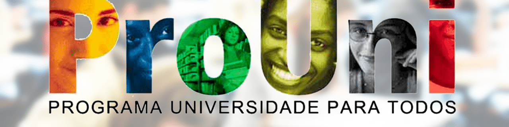

    
# **Acesso dos grupos minoritários ao Ensino Superior através do Prouni**

---
## **Sobre o projeto**
### O projeto consiste na análise de dados das bolsas concedidas e das notas de corte do ano de 2018. O objetivo é comparar a entrada por grupos de raças, gêneros e deficientes físicos.

### O desenvolvimento do projeto foi feito a partir da Análise exploratória das bolsas concedidas em diversos Estados do Brasil ao longo dos anos. Para a visualização da nossa análise foi utilizado o Tableau.

## **Documentação**
### Para acessar a [Documentação](https://github.com/soaresana/projeto4-vamoai/blob/main/DOCUMENTAÇÃO.md) clique aqui!

## **Vizualização dos dados via Tableau**
### Para acessar nossa visualização de dados via [Tableau](https://public.tableau.com/app/profile/ana.luiza.soares/viz/Projetomdulo4-Prouni/Apresentao), clique aqui!

## **Apresentação do Projeto**
### Acessar apresentação do projeto [aqui](https://www.canva.com/design/DAEjC27k1Wk/HFRTSpeQl_UGLhLFlE5Slw/view?utm_content=DAEjC27k1Wk&utm_campaign=designshare&utm_medium=link&utm_source=sharebutton)!
---

## **Colaboradores do projeto**

## [Ana Luiza](https://github.com/soaresana) | [Ramon Brito](https://github.com/ramonbrito1995) | [Jênnifer Stéfani](https://github.com/jenniferstefaniks)

